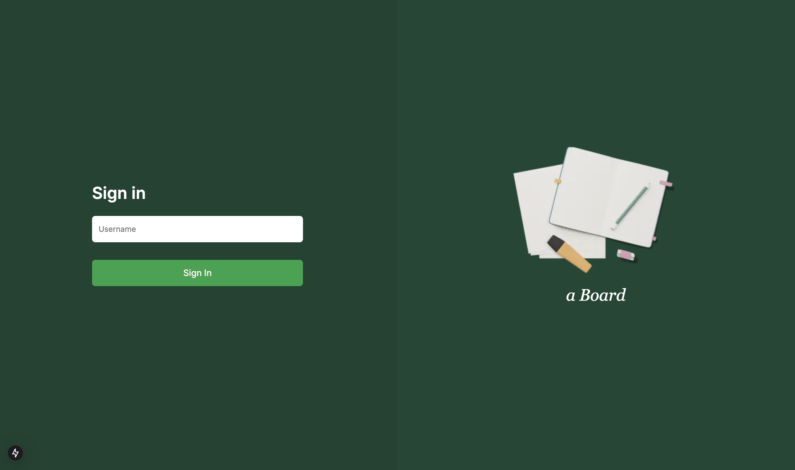

# a-board

## Overview

a-board is a web application designed to provide a platform for users to create and manage boards for various purposes.

## Features

- **User Authentication**: login via username.
- **Board**: Users can view and comment within boards.
- **Post Management**: Create, edit, and delete posts within boards.

## Technologies Used

- **Frontend**: Next.js, Typescript, Tailwind CSS, Shadcn/ui
- **Backend**: NestJS
- **Database**: MySQL
- **Containerization**: Docker

## Getting Started

### Prerequisites

- Docker installed on your machine.

### Installation

1. **Clone the repository**:
   ```bash
   git clone https://github.com/amornpic/a-board.git
   ```
2. **Navigate to the project directory**:
   ```bash
   cd a-board
   ```
3. **Set up environment variablesy**:
   - Rename .env.example to .env.
   - Fill in the necessary environment variables in the .env file.
4. **Start the application using Docker Compose:**:
   ```bash
   docker-compose up --build
   ```
   This command will build and start the frontend, backend, and database services.
5. **Access the application**:
    - **Frontend**: http://localhost:3000
    - **Backend API**: http://localhost:3002

### How to create a user
- Import a-board.postman_collection.json to Postman
- Call to **Create user API** in a-board postman collection

### How to run test (backend)
1. **Navigate to the backend directory**:
   ```bash
   cd backend
   ```
2. **Run this command**:
   ```bash
   npm run test
   ```

### Entity Relationship (ER) Diagram


### Screenshots



